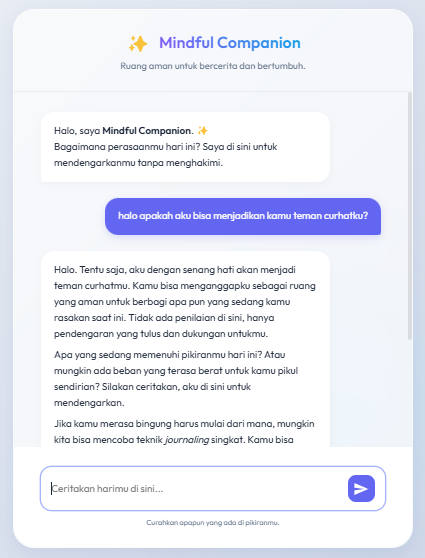

# Mindful Companion AI ✨

**Mindful Companion** adalah chatbot kesehatan mental berbasis AI yang dirancang untuk menjadi ruang aman bagi pengguna untuk bercerita (journaling harian) dan mendapatkan saran teknik relaksasi. 

Proyek ini dibuat sebagai *Final Project* untuk pelatihan **AI Productivity and AI API Integration for Developers**.

## ✨ Fitur Utama
- **Empathetic AI Persona**: Dikonfigurasi menggunakan **Gemini 3.1 Flash Lite** untuk merespon dengan gaya bahasa yang menenangkan dan mendukung.
- **Daily Journaling**: Membantu pengguna merefleksikan hari mereka dengan pertanyaan terbuka.
- **Relaxation Techniques**: Memberikan saran teknik pernapasan dan *grounding* saat dibutuhkan.
- **Premium UI**: Desain modern dengan efek *Glassmorphism* dan animasi yang halus.

## 📸 Tampilan Antarmuka


## 🛠️ Teknologi yang Digunakan
- **Frontend**: HTML5, Vanilla CSS, JavaScript.
- **Backend**: Node.js, Express.js.
- **AI Model**: Google Gemini 3.1 Flash Lite.
- **Formatting**: Marked.js untuk render teks markdown.

## 🚀 Cara Menjalankan Secara Lokal

1. **Clone Repositori**
   ```bash
   git clone https://github.com/mridhafajri/mindful-companion-chatbot.git
   cd mindful-companion-chatbot
   ```

2. **Instal Dependensi**
   ```bash
   npm install
   ```

3. **Konfigurasi API Key**
   - Buat file `.env` di direktori utama.
   - Masukkan API Key Gemini Anda:
     ```env
     GEMINI_API_KEY=isi_dengan_api_key_anda
     ```

4. **Jalankan Server**
   ```bash
   node index.js
   ```
   Buka `http://localhost:3000` di browser Anda.

---
Dibuat dengan ❤️ oleh M Ridha Fajri.
